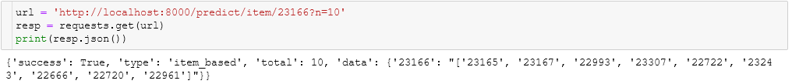
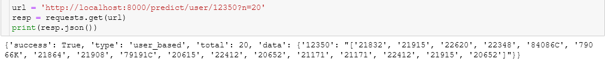
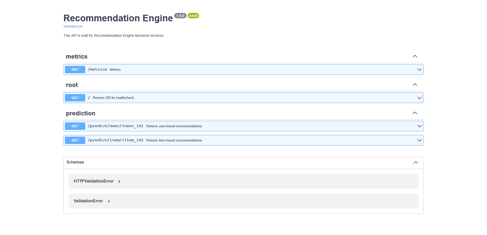
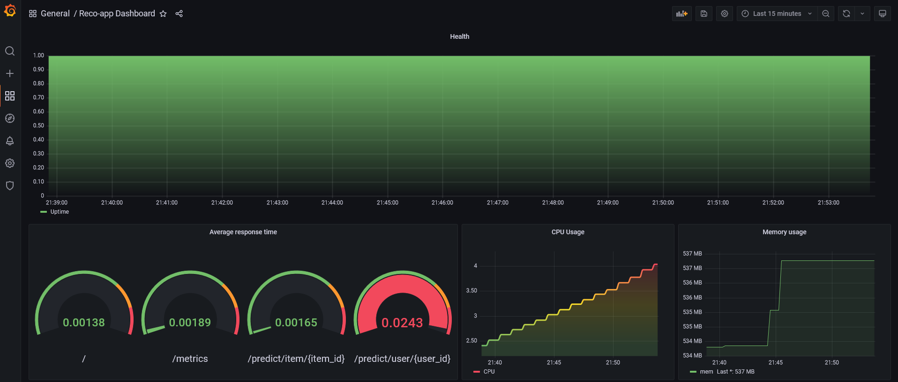
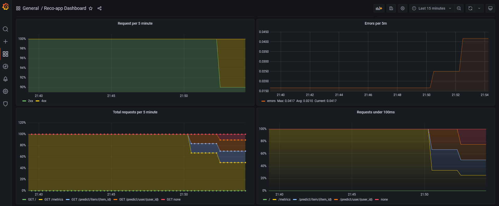

# FastAPI 


<br>

<p style="text-align:center">

 


</p>
<br>
<br> 

<p>
<p style="text-align:center">
 
</p>


This is a Kubernetes version of [reco-model-monitoring](https://github.com/silverstone1903/reco-model-monitoring) project. FastAPI, Grafana & Prometheus run on Kubernetes.


<br> <br>

## Installation

There is only one prerequisites:

* [Kubernetes](https://kubernetes.io/docs/tasks/tools/)

<br>

``` bash
git clone https://github.com/silverstone1903/reco-app-k8s
```

## Usage

### Start 

First create a namespace called `monitoring`.
```bash
kubectl create namespace monitoring
```

``` bash
kubectl apply -f manifests/.
```

Check pods, services and deployments

```bash
kubectl get pods -n monitoring --show-labels
kubectl get svc -n monitoring -o wide
kubectl get deployment -n monitoring -o wide
```


Scale a replicaset 
```bash
kubectl scale --replicas 3 deployment reco-app -n monitoring
```

### Logs
If you want to check pod logs with `kubectl` you can use `logs`.

``` bash
kubectl logs --selector app=reco-app -n monitoring
kubectl logs --selector app=grafana -n monitoring
kubectl logs --selector app=prometheus-server -n monitoring
```

### Stop & delete all resources

``` bash
kubectl delete -f manifests/.
kubectl delete ns monitoring
```

## URLs

* FastAPI: http://localhost:8000
* Prometheus: http://localhost:9090
* Grafana: http://localhost:3000


<!-- 
<br>

Blog post (in Turkish): [Reco Model Monitoring - FastAPI + Prometheus + Grafana](https://silverstone1903.github.io/posts/2021/12/reco-model-monitoring)

<br> -->

# Screenshots
## API
<p align="center">
  
  
  
</p>

## Grafana
<p align="center">
  
  

</p>

